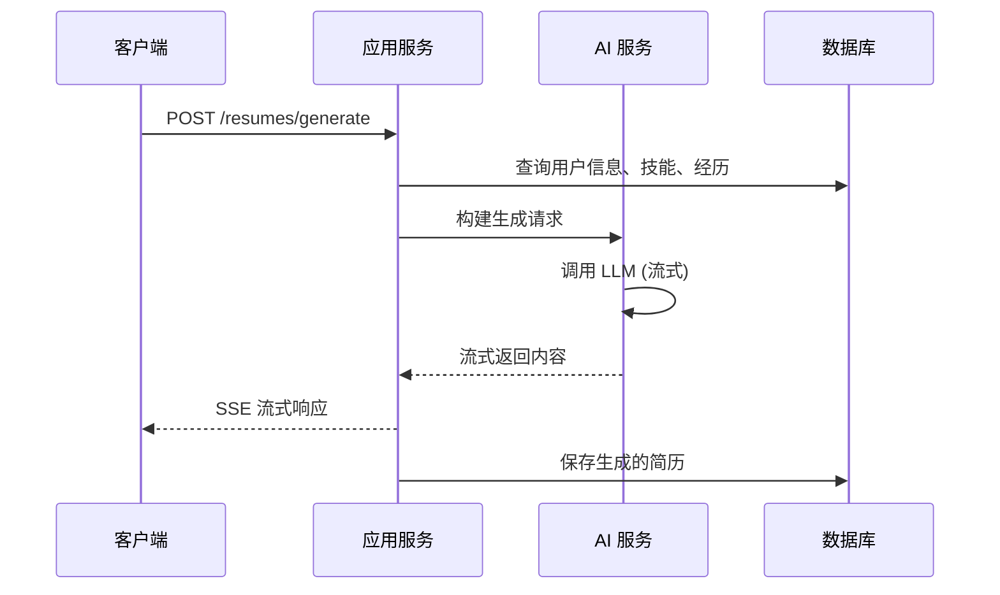
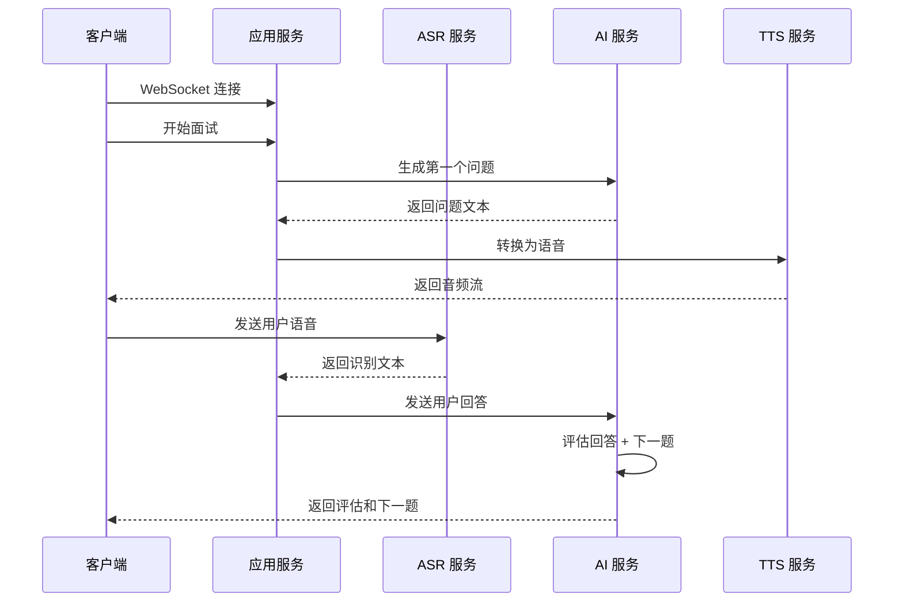
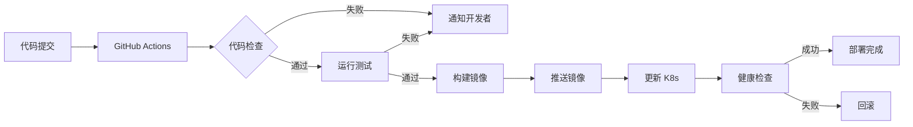

# AI 求职辅助平台技术架构设计

## 目录
- [1. 架构概述](#1-架构概述)
- [2. 整体架构设计](#2-整体架构设计)
- [3. 前端架构](#3-前端架构)
- [4. 后端架构](#4-后端架构)
- [5. AI 能力层设计](#5-ai-能力层设计)
- [6. 数据层设计](#6-数据层设计)
- [7. 基础设施](#7-基础设施)
- [8. 安全架构](#8-安全架构)
- [9. 技术风险评估](#9-技术风险评估)

---

## 1. 架构概述

### 1.1 系统目标

构建一个基于 AI 的全流程求职辅助平台，通过 AI 技术降低求职门槛，提高求职效率和成功率。系统需要支持从岗位识别到面试准备的全流程辅助，并提供良好的用户体验。

### 1.2 核心功能模块

| 功能模块 | 描述 | AI 能力需求 |
|---------|------|------------|
| 岗位智能识别 | 多方式导入岗位信息，智能解析 JD | OCR + NLP |
| 技能发掘 | AI 对话引导，发现用户隐藏技能 | LLM 对话 |
| 经历梳理 | STAR 法则梳理，提取项目亮点 | LLM 提取 |
| 简历生成 | 定制化简历生成，多模板导出 | LLM 生成 |
| 面试准备 | 个性化准备计划，题库预测 | LLM 推理 |
| 模拟面试 | 实时语音交互，评估报告 | ASR + LLM + TTS |

### 1.3 非功能性需求

- **性能**: AI 响应时间 < 3秒（流式输出首字 < 1秒）
- **可用性**: 99.9% SLA
- **并发**: 支持 10,000+ 并发用户
- **扩展性**: 模块化设计，支持横向扩展
- **合规性**: 符合国内数据安全法规，支持备案

---

## 2. 整体架构设计

### 2.1 架构模式选择

**推荐方案: 模块化单体架构 (Modular Monolith)**

**选择理由**:
1. **初期开发效率高**: 团队规模有限，避免微服务复杂度
2. **部署运维简单**: 单一部署单元，降低运维成本
3. **性能更优**: 避免服务间调用延迟
4. **易于演进**: 清晰的模块边界，未来可拆分为微服务
5. **事务处理简单**: 本地事务即可满足需求

**演进路径**: 当单模块 QPS > 5000 或团队规模 > 20 人时，考虑拆分为微服务

### 2.2 系统架构图

```
┌─────────────────────────────────────────────────────────────────────────┐
│                              客户端层                                     │
├─────────────────────────────┬───────────────────────────────────────────┤
│       Web 端 (React)        │      移动端 (Flutter / 小程序)            │
│   - 响应式设计              │   - 跨平台统一                             │
│   - 管理后台                │   - 原生体验                               │
└─────────────┬───────────────┴───────────────────┬───────────────────────┘
              │                                   │
              │          HTTPS/WSS                │
              │                                   │
┌─────────────▼───────────────────────────────────▼───────────────────────┐
│                              网关层                                        │
│                     Nginx / API Gateway                                   │
│          - 负载均衡  - 限流熔断  - 静态资源  - SSL 终止                    │
└─────────────┬─────────────────────────────────────────────────────────────┘
              │
┌─────────────▼─────────────────────────────────────────────────────────────┐
│                            应用层                                          │
├─────────────┬─────────────┬─────────────┬─────────────┬─────────────────┤
│  用户服务   │  岗位服务   │  简历服务   │  面试服务   │   AI 服务       │
│             │             │             │             │                 │
│ - 认证授权  │ - JD 解析   │ - 简历生成  │ - 题库管理  │ - LLM 编排     │
│ - 用户管理  │ - 岗位匹配  │ - 模板管理  │ - 模拟面试  │ - Prompt 管理   │
│ - 订阅管理  │ - 智能推荐  │ - 导出转换  │ - 评估报告  │ - 工具调用      │
└─────────────┴─────────────┴─────────────┴─────────────┴─────────────────┘
              │
┌─────────────▼─────────────────────────────────────────────────────────────┐
│                          AI 能力层                                         │
├─────────────┬─────────────┬─────────────┬─────────────┬─────────────────┤
│    LLM      │    OCR      │    ASR      │    TTS      │  向量数据库     │
│             │             │             │             │                 │
│ - GPT-4     │ - 云厂商 OCR │ - 语音识别  │ - 语音合成  │ - RAG 检索     │
│ - Claude    │ - Tesseract │ - 实时转写  │ - 多音色    │ - 语义匹配     │
│ - 文心一言  │             │             │             │                 │
└─────────────┴─────────────┴─────────────┴─────────────┴─────────────────┘
              │
┌─────────────▼─────────────────────────────────────────────────────────────┐
│                          数据层                                            │
├─────────────┬─────────────┬─────────────┬─────────────┬─────────────────┤
│ PostgreSQL  │    Redis    │   OSS/S3    │  MongoDB    │   ClickHouse    │
│             │             │             │             │                 │
│ - 业务数据  │ - 缓存      │ - 文件存储  │ - 日志存储  │ - 数据分析      │
│ - 用户数据  │ - 会话      │ - 简历 PDF  │ - 聊天记录  │ - 行为分析      │
│ - 关系数据  │ - 队列      │ - 头像图片  │             │                 │
└─────────────┴─────────────┴─────────────┴─────────────┴─────────────────┘
              │
┌─────────────▼─────────────────────────────────────────────────────────────┐
│                        基础设施层                                          │
│  - 云服务 (阿里云/腾讯云)  - K8s/Docker  - CI/CD  - 监控告警              │
└─────────────────────────────────────────────────────────────────────────┘
```

### 2.3 技术栈选型

#### 2.3.1 后端技术栈

| 技术组件 | 选型方案 | 理由 |
|---------|---------|------|
| 编程语言 | **Node.js (TypeScript)** | • 异步 I/O 适合 AI 调用密集型场景<br>• 生态丰富，AI 库支持好<br>• 前后端统一技术栈 |
| Web 框架 | **NestJS** | • 企业级框架，结构清晰<br>• 原生 TypeScript 支持<br>• 依赖注入，便于测试<br>• 模块化架构，支持微服务演进 |
| ORM | **Prisma** | • 类型安全，自动生成类型<br>• 迁移管理简单<br>• 开发体验优秀 |
| API 风格 | **REST + GraphQL** | • REST 对外接口<br>• GraphQL 内部复杂查询 |
| 验证 | **class-validator + class-transformer** | • 装饰器风格，与 NestJS 无缝集成<br>• 自动类型转换 |
| 任务队列 | **BullMQ (Redis)** | • 基于 Redis，轻量高效<br>• 支持定时任务、延迟任务<br>• Web UI 监控面板 |

#### 2.3.2 AI/ML 技术栈

| 技术组件 | 选型方案 | 理由 |
|---------|---------|------|
| LLM 框架 | **LangChain.js** | • 功能完善的 LLM 编排框架<br>• 支持 Chain、Agent、Memory<br>• 丰富的集成（向量库、工具）<br>• TypeScript 原生支持 |
| 向量数据库 | ** pgvector (PostgreSQL)** | • 无需额外数据库，降低运维<br>• 适合中小规模数据<br>• 与业务数据联合查询 |
| LLM 提供商 | **多厂商策略** | • 国外: OpenAI (GPT-4), Anthropic (Claude)<br>• 国内: 百度 (文心), 阿里 (通义)<br>• 实现降级和切换逻辑 |
| OCR | **云厂商 OCR + Tesseract** | • 云 OCR: 高精度，场景化<br>• Tesseract: 本地降级方案 |
| ASR/TTS | **云厂商语音服务** | • 国内: 阿里云/腾讯云<br>• 国外: Azure Speech/Deepgram |

#### 2.3.3 前端技术栈

| 技术组件 | Web 端 | 移动端 |
|---------|--------|--------|
| 框架 | **Next.js 14** | **Flutter** |
| 状态管理 | **Zustand** | **Provider/Riverpod** |
| UI 组件 | **shadcn/ui + TailwindCSS** | **Material Design 3** |
| 表单 | **React Hook Form + Zod** | **Flutter Form** |
| HTTP | **axios + TanStack Query** | **dio + provider** |
| 实时通信 | **Socket.io Client** | **socket_io_client** |

**Next.js 选择理由**:
- SSR/SSG 支持，SEO 友好
- App Router 架构现代
- 服务组件减少客户端负担
- 内置 API Routes 支持 BFF
- Vite 极速开发体验

**Flutter 选择理由**:
- 单代码库 iOS/Android
- 原生级性能和体验
- 热重载提升开发效率
- 丰富的 UI 组件
- 可部署为 Web 端降级方案

---

## 3. 前端架构

### 3.1 Web 端架构

#### 3.1.1 目录结构

```
apps/web/
├── src/
│   ├── app/                    # Next.js App Router
│   │   ├── (auth)/            # 认证相关页面
│   │   │   ├── login/
│   │   │   └── register/
│   │   ├── (dashboard)/       # 主应用页面
│   │   │   ├── jobs/          # 岗位管理
│   │   │   ├── skills/        # 技能发掘
│   │   │   ├── resume/        # 简历生成
│   │   │   └── interview/     # 面试准备
│   │   ├── api/               # API Routes (BFF)
│   │   └── layout.tsx
│   ├── components/            # 组件
│   │   ├── ui/               # shadcn/ui 基础组件
│   │   ├── features/         # 业务组件
│   │   └── layouts/          # 布局组件
│   ├── lib/                  # 工具库
│   │   ├── api/              # API 客户端
│   │   ├── query/            # TanStack Query 配置
│   │   └── utils/            # 工具函数
│   ├── stores/               # Zustand 状态管理
│   ├── hooks/                # 自定义 Hooks
│   └── types/                # TypeScript 类型
└── public/                   # 静态资源
```

#### 3.1.2 状态管理方案

**Zustand + TanStack Query 组合**

| 数据类型 | 管理方案 | 示例 |
|---------|---------|------|
| 服务端状态 | **TanStack Query** | 用户信息、岗位列表、简历数据 |
| 客户端状态 | **Zustand** | UI 状态、表单临时数据、模态框状态 |
| 表单状态 | **React Hook Form** | 各类表单管理 |

```typescript
// Zustand Store 示例
interface AppState {
  currentJob: Job | null;
  setCurrentJob: (job: Job | null) => void;
}

const useAppStore = create<AppState>((set) => ({
  currentJob: null,
  setCurrentJob: (job) => set({ currentJob: job }),
}));

// TanStack Query 示例
const useJobs = () => {
  return useQuery({
    queryKey: ['jobs'],
    queryFn: () => api.jobs.list(),
  });
};
```

#### 3.1.3 关键页面结构

**岗位识别页面**
```
JobRecognitionPage
├── JobInputMethod (导入方式选择)
│   ├── ScreenshotUpload (截图上传)
│   ├── URLInput (链接输入)
│   └── TextPaste (文本粘贴)
├── JobParsingStatus (解析状态)
├── JobPreview (岗位预览)
└── JobEdit (岗位编辑)
```

**简历生成页面**
```
ResumeGeneratorPage
├── TemplateSelector (模板选择)
├── ResumeEditor (简历编辑器)
│   ├── PersonalInfoSection
│   ├── SkillsSection
│   ├── ExperienceSection
│   └── ProjectSection
├── MatchScoreIndicator (匹配度评分)
└── ExportToolbar (导出工具栏)
```

**模拟面试页面**
```
MockInterviewPage
├── InterviewSetup (面试设置)
├── VoiceInterface (语音交互界面)
│   ├── Visualizer (音频可视化)
│   ├── TranscriptDisplay (对话记录)
│   └── Controls (控制按钮)
├── QuestionDisplay (问题展示)
└── ReportGenerator (评估报告)
```

### 3.2 移动端架构 (Flutter)

#### 3.2.1 目录结构

```
apps/mobile/
├── lib/
│   ├── core/
│   │   ├── constants/      # 常量
│   │   ├── theme/          # 主题
│   │   └── utils/          # 工具
│   ├── data/
│   │   ├── models/         # 数据模型
│   │   ├── repositories/   # 仓储层
│   │   └── services/       # API 服务
│   ├── presentation/
│   │   ├── pages/          # 页面
│   │   ├── widgets/        # 组件
│   │   └── providers/      # Provider
│   └── main.dart
└── ios/ & android/
```

#### 3.2.2 移动端特殊考虑

| 能力 | 实现方案 |
|-----|---------|
| 截图导入 | 系统相册集成 + 图片裁剪 |
| 语音交互 | flutter_sound + 录音权限管理 |
| 简历导出 | PDF 生成 + 分享功能 |
| 离线支持 | Hive 本地存储 |
| 推送通知 | firebase_messaging |

### 3.3 设计系统

**设计 Token 规范**

```typescript
// tokens.ts
export const tokens = {
  colors: {
    primary: {
      50: '#eff6ff',
      500: '#3b82f6',
      900: '#1e3a8a',
    },
    // ...
  },
  spacing: {
    xs: '0.25rem',
    sm: '0.5rem',
    md: '1rem',
    lg: '1.5rem',
    xl: '2rem',
  },
  typography: {
    fontFamily: {
      sans: ['Inter', 'system-ui', 'sans-serif'],
    },
  },
};
```

---

## 4. 后端架构

### 4.1 服务模块划分

#### 4.1.1 模块架构

```
src/
├── modules/
│   ├── user/                 # 用户模块
│   │   ├── user.controller.ts
│   │   ├── user.service.ts
│   │   ├── user.module.ts
│   │   ├── entities/
│   │   └── dto/
│   ├── job/                  # 岗位模块
│   ├── resume/               # 简历模块
│   ├── interview/            # 面试模块
│   ├── ai/                   # AI 服务模块
│   ├── subscription/         # 订阅模块
│   └── notification/         # 通知模块
├── common/                   # 公共模块
│   ├── auth/                 # 认证授权
│   ├── cache/                # 缓存
│   ├── database/             # 数据库
│   ├── logging/              # 日志
│   ├── filters/              # 异常过滤器
│   └── decorators/           # 装饰器
└── config/                   # 配置
```

#### 4.1.2 模块职责

| 模块 | 职责 | 核心 API |
|-----|------|---------|
| **user** | 用户管理、认证授权 | POST /auth/register, POST /auth/login |
| **job** | 岗位解析、管理、匹配 | POST /jobs/parse, GET /jobs/match |
| **resume** | 简历生成、模板管理 | POST /resumes/generate, GET /resumes/templates |
| **interview** | 面试准备、模拟面试 | POST /interviews/mock, WS /interviews/stream |
| **ai** | AI 能力编排、Prompt 管理 | POST /ai/chat, POST /ai/tools |
| **subscription** | 订阅、支付、配额 | POST /subscriptions/checkout |
| **notification** | 消息通知、推送 | POST /notifications/send |

### 4.2 API 设计规范

#### 4.2.1 RESTful API 规范

**命名约定**
```
GET    /api/v1/jobs              # 列表
GET    /api/v1/jobs/:id          # 详情
POST   /api/v1/jobs              # 创建
PUT    /api/v1/jobs/:id          # 更新
PATCH  /api/v1/jobs/:id          # 部分更新
DELETE /api/v1/jobs/:id          # 删除
```

**响应格式**
```typescript
// 成功响应
{
  "success": true,
  "data": { ... },
  "meta": {
    "timestamp": "2026-02-15T10:00:00Z"
  }
}

// 错误响应
{
  "success": false,
  "error": {
    "code": "VALIDATION_ERROR",
    "message": "请求参数验证失败",
    "details": [
      {
        "field": "email",
        "message": "邮箱格式不正确"
      }
    ]
  }
}

// 列表响应
{
  "success": true,
  "data": {
    "items": [ ... ],
    "pagination": {
      "page": 1,
      "pageSize": 20,
      "total": 100,
      "totalPages": 5
    }
  }
}
```

#### 4.2.2 WebSocket API 设计

**模拟面试实时通信**

```typescript
// 客户端 → 服务器
{
  "type": "audio_chunk",
  "data": "<base64_audio>",
  "timestamp": 1234567890
}

// 服务器 → 客户端
{
  "type": "ai_response",
  "data": {
    "text": "请介绍一下你自己",
    "audioUrl": "https://...",
    "questionType": "自我介绍"
  }
}
```

#### 4.2.3 核心业务流程设计

**简历生成流程**



**模拟面试流程**



### 4.3 数据传输与序列化

**DTO 定义示例**

```typescript
// create-job.dto.ts
export class CreateJobDto {
  @IsString()
  @IsOptional()
  source?: string; // 来源: screenshot/url/text

  @IsString()
  @IsOptional()
  url?: string;

  @IsString()
  @IsOptional()
  content?: string;

  @IsString()
  @IsOptional()
  fileKey?: string; // OSS 文件 key
}

// job-response.dto.ts
export class JobResponseDto {
  id: string;
  title: string;
  company: string;
  requirements: string[];
  responsibilities: string[];
  salary: SalaryRange;
  matchedSkills: string[];
  matchScore: number;
  createdAt: Date;
}
```

---

## 5. AI 能力层设计

### 5.1 LLM 调用方案

#### 5.1.1 多厂商策略

```typescript
// ai-provider.ts
interface AIProvider {
  name: 'openai' | 'anthropic' | 'wenxin' | 'tongyi';
  chat(params: ChatParams): Promise<ChatResponse>;
  stream(params: ChatParams): AsyncIterable<ChatChunk>;
}

class AIProviderManager {
  private providers: AIProvider[] = [
    new OpenAIProvider(),      // 主力
    new AnthropicProvider(),   // 备用
    new WenxinProvider(),      // 国内降级
    new TongyiProvider(),      // 国内备用
  ];

  async chat(params: ChatParams, provider?: string) {
    const selectedProvider = provider
      ? this.getProvider(provider)
      : this.selectBestProvider(params);

    try {
      return await selectedProvider.chat(params);
    } catch (error) {
      return await this.failover(params, selectedProvider);
    }
  }

  private selectBestProvider(params: ChatParams): AIProvider {
    // 根据用户等级、任务类型、成本选择
    if (params.userTier === 'free') {
      return this.getProvider('wenxin'); // 免费用户用国内便宜模型
    }
    return this.getProvider('openai');
  }
}
```

#### 5.1.2 成本控制策略

| 策略 | 实现方式 |
|-----|---------|
| **模型分级** | 免费用户用 GPT-3.5/文心，付费用 GPT-4/Claude |
| **Token 限制** | 单次请求限制 token 数量 |
| **缓存复用** | 相似问题使用缓存结果 |
| **Prompt 压缩** | 移除冗余信息，使用提示词模板 |
| **流式输出** | 降低首字延迟，提升体验 |

```typescript
// 成本优化示例
class CostOptimizedChat {
  async chat(params: ChatParams) {
    // 1. 检查缓存
    const cached = await this.cache.get(params.hash);
    if (cached) return cached;

    // 2. 压缩 prompt
    const compressedPrompt = this.compressPrompt(params.messages);

    // 3. 选择模型
    const model = this.selectModel(params);

    // 4. 调用 LLM
    const response = await this.provider.chat({
      ...params,
      messages: compressedPrompt,
      model,
    });

    // 5. 缓存结果
    await this.cache.set(params.hash, response, 3600);

    return response;
  }
}
```

#### 5.1.3 响应优化策略

| 优化点 | 方案 | 目标 |
|-------|------|------|
| **首字延迟** | 流式响应 + 预加载 | < 1秒 |
| **网络延迟** | 国内用户就近接入 | < 500ms |
| **并发处理** | 请求队列 + 限流 | 避免超限 |
| **错误恢复** | 自动重试 + 降级 | 99% 成功率 |

### 5.2 Prompt 工程策略

#### 5.2.1 Prompt 模板管理

```typescript
// prompt-templates.ts
export const promptTemplates = {
  jobParsing: `
你是一位专业的招聘信息解析专家。请分析以下岗位描述，提取关键信息：

岗位描述：
{jobDescription}

请以 JSON 格式返回：
{{
  "title": "岗位名称",
  "company": "公司名称",
  "requirements": ["要求1", "要求2"],
  "responsibilities": ["职责1", "职责2"],
  "skills": ["技能1", "技能2"],
  "salary": {{ "min": 10000, "max": 20000, "currency": "CNY" }}
}}
`,

  resumeGeneration: `
你是一位专业的简历写作专家。根据以下信息生成一份针对目标岗位的简历：

用户信息：
{userProfile}

目标岗位：
{jobDescription}

要求：
1. 突出与岗位要求匹配的技能和经验
2. 使用 STAR 法则描述项目经历
3. 量化工作成果
4. 保持专业、简洁的语言风格

请返回 Markdown 格式的简历内容。
`,

  interviewQuestion: `
你是一位专业的面试官。根据以下信息生成面试问题：

岗位信息：
{jobInfo}

用户简历：
{userResume}

请生成 5 个针对性的面试问题，涵盖：
1. 自我介绍
2. 项目经验
3. 技术能力
4. 软技能
5. 职业规划

对每个问题，提供：
- 问题内容
- 考察要点
- 参考回答要点
`,
};
```

#### 5.2.2 RAG (检索增强生成)

```typescript
// rag-service.ts
class RAGService {
  async generateWithRAG(query: string, context: RAGContext) {
    // 1. 向量化查询
    const embedding = await this.embed(query);

    // 2. 相似度检索
    const relevantDocs = await this.vectorDb.search({
      vector: embedding,
      filter: { userId: context.userId },
      limit: 5,
    });

    // 3. 构建增强 prompt
    const augmentedPrompt = this.buildPrompt({
      query,
      context: relevantDocs.map(d => d.content).join('\n'),
    });

    // 4. 生成回答
    return await this.llm.chat(augmentedPrompt);
  }
}
```

### 5.3 OCR 集成方案

```typescript
// ocr-service.ts
class OCRService {
  async recognizeImage(imageKey: string): Promise<string> {
    const image = await this.oss.get(imageKey);

    // 优先使用云 OCR
    try {
      return await this.cloudOCR.recognize(image);
    } catch (error) {
      // 降级到本地 OCR
      return await this.localOCR.recognize(image);
    }
  }
}
```

**OCR 服务选型**

| 服务 | 优势 | 劣势 | 场景 |
|-----|------|------|------|
| 阿里云 OCR | 场景化识别（表格、票据） | 需要付费 | 复杂排版 JD |
| 腾讯云 OCR | 速度快 | 较贵 | 实时识别 |
| Tesseract | 开源免费 | 精度较低 | 降级备用 |

### 5.4 ASR/TTS 集成方案

**语音服务架构**

```typescript
// voice-service.ts
class VoiceService {
  private asr: ASRProvider;
  private tts: TTSProvider;

  async transcribe(audio: AudioStream): Promise<string> {
    // 1. 音频预处理（降噪、格式转换）
    const processed = await this.preprocess(audio);

    // 2. 实时转写
    return await this.asr.transcribe(processed, {
      language: 'zh-CN',
      interimResults: true,
    });
  }

  async synthesize(text: string, voice: VoiceConfig): Promise<AudioStream> {
    return await this.tts.synthesize(text, {
      voice: voice.id || 'xiaoyun',
      rate: voice.rate || 1.0,
      pitch: voice.pitch || 1.0,
    });
  }
}
```

**服务选型**

| 服务 | ASR | TTS | 选择理由 |
|-----|-----|-----|---------|
| 阿里云 | ✓ | ✓ | 国内稳定，中文效果好 |
| 腾讯云 | ✓ | ✓ | 性价比高 |
| Azure | ✓ | ✓ | 国际备用 |

---

## 6. 数据层设计

### 6.1 数据库选型

| 数据类型 | 存储方案 | 理由 |
|---------|---------|------|
| 业务数据 | **PostgreSQL** | • 关系型，事务支持<br>• JSON 字段灵活<br>• pgvector 支持向量检索<br>• 开源稳定 |
| 缓存/会话 | **Redis** | • 高性能读写<br>• 丰富数据结构<br>• 支持分布式锁 |
| 文件存储 | **阿里云 OSS / 腾讯云 COS** | • 高可用<br>• CDN 加速<br>• 成本低 |
| 日志/聊天记录 | **MongoDB** | • 文档型，适合非结构化数据<br>• 海量数据存储<br>• 灵活的查询 |
| 数据分析 | **ClickHouse** | • 列式存储<br>• 实时分析<br>• 高性能聚合查询 |

### 6.2 核心数据模型

#### 6.2.1 ER 图描述

```
User (用户)
  ├── Profile (用户档案)
  ├── Skills (技能)
  ├── Experiences (工作经历)
  ├── Projects (项目经历)
  ├── Jobs (岗位记录)
  ├── Resumes (简历记录)
  └── Interviews (面试记录)
```

#### 6.2.2 Prisma Schema

```prisma
// schema.prisma

datasource db {
  provider = "postgresql"
  url      = env("DATABASE_URL")
}

generator client {
  provider = "prisma-client-js"
}

// ============== 用户相关 ==============

model User {
  id            String    @id @default(cuid())
  email         String    @unique
  phone         String?   @unique
  passwordHash  String
  nickname      String
  avatar        String?

  subscription  Subscription?
  profiles      Profile[]
  jobs          Job[]
  resumes       Resume[]
  interviews    Interview[]

  createdAt     DateTime  @default(now())
  updatedAt     DateTime  @updatedAt

  @@index([email])
}

model Profile {
  id              String   @id @default(cuid())
  userId          String   @unique
  user            User     @relation(fields: [userId], references: [id])

  name            String
  gender          String?
  birthDate       DateTime?
  location        String?
  education       String?
  workYears       Int?

  selfIntro       String?  @db.Text
  careerGoals     String?  @db.Text

  skills          Skill[]
  experiences     Experience[]
  projects        Project[]

  createdAt       DateTime @default(now())
  updatedAt       DateTime @updatedAt
}

model Skill {
  id          String   @id @default(cuid())
  profileId   String
  profile     Profile  @relation(fields: [profileId], references: [id])

  name        String
  category    String   // technical, soft, language
  level       Int      // 1-5
  verified    Boolean  @default(false) // AI 是否验证

  @@index([profileId, category])
}

model Experience {
  id          String   @id @default(cuid())
  profileId   String
  profile     Profile  @relation(fields: [profileId], references: [id])

  company     String
  position    String
  startDate   DateTime
  endDate     DateTime?
  current     Boolean  @default(false)

  description String?  @db.Text
  highlights  String[] @db.Text[]

  createdAt   DateTime @default(now())
  updatedAt   DateTime @updatedAt

  @@index([profileId])
}

model Project {
  id          String   @id @default(cuid())
  profileId   String
  profile     Profile  @relation(fields: [profileId], references: [id])

  name        String
  role        String
  startDate   DateTime
  endDate     DateTime?

  description String   @db.Text
  techStack   String[]
  achievements String[] @db.Text[]

  createdAt   DateTime @default(now())
  updatedAt   DateTime @updatedAt

  @@index([profileId])
}

// ============== 岗位相关 ==============

model Job {
  id          String   @id @default(cuid())
  userId      String
  user        User     @relation(fields: [userId], references: [id])

  title       String
  company     String
  location    String?

  source      String   // screenshot, url, text
  sourceUrl   String?
  sourceFile  String?

  description String   @db.Text
  requirements Json     // 存储解析后的结构化数据

  matchScore  Float?   // 与用户匹配度
  matchedSkills String[]

  status      String   @default("active") // active, archived, applied

  resumes     Resume[]

  createdAt   DateTime @default(now())
  updatedAt   DateTime @updatedAt

  @@index([userId, status])
}

// ============== 简历相关 ==============

model Resume {
  id          String   @id @default(cuid())
  userId      String
  user        User     @relation(fields: [userId], references: [id])
  jobId       String?
  job         Job?     @relation(fields: [jobId], references: [id])

  name        String
  templateId  String

  content     Json     // 简历内容

  fileUrl     String?  // 生成的 PDF URL

  matchScore  Float?

  createdAt   DateTime @default(now())
  updatedAt   DateTime @updatedAt

  @@index([userId])
}

model ResumeTemplate {
  id          String   @id @default(cuid())

  name        String
  category    String   // technical, general, creative
  thumbnail   String
  preview     String

  config      Json     // 模板配置

  isPremium   Boolean  @default(false)

  createdAt   DateTime @default(now())
  updatedAt   DateTime @updatedAt
}

// ============== 面试相关 ==============

model Interview {
  id          String   @id @default(cuid())
  userId      String
  user        User     @relation(fields: [userId], references: [id])

  type        String   // mock, preparation
  status      String   @default("pending") // pending, in_progress, completed

  jobContext  Json?    // 关联的岗位信息

  questions   Json     // 面试问题列表

  // 模拟面试相关
  transcript  Json?    // 对话记录
  report      Json?    // 评估报告

  createdAt   DateTime @default(now())
  updatedAt   DateTime @updatedAt

  @@index([userId, status])
}

model QuestionBank {
  id          String   @id @default(cuid())

  category    String   // behavioral, technical, hr
  position    String?  // 职位类型
  difficulty  String   // easy, medium, hard

  question    String   @db.Text
  keypoints   String[] @db.Text[]

  usageCount  Int      @default(0)

  createdAt   DateTime @default(now())
  updatedAt   DateTime @updatedAt

  @@index([category, position])
}

// ============== 订阅相关 ==============

model Subscription {
  id          String   @id @default(cuid())
  userId      String   @unique
  user        User     @relation(fields: [userId], references: [id])

  plan        String   // free, basic, pro

  aiQuota     Int      @default(10) // AI 调用次数
  resumeQuota Int      @default(3)  // 简历生成次数

  startDate   DateTime
  endDate     DateTime?

  autoRenew   Boolean  @default(false)

  createdAt   DateTime @default(now())
  updatedAt   DateTime @updatedAt
}

// ============== 系统相关 ==============

model UsageLog {
  id          String   @id @default(cuid())
  userId      String

  action      String   // resume_generate, ai_chat, etc.
  resource    String

  costTokens  Int?
  costCNY     Decimal?

  metadata    Json?

  createdAt   DateTime @default(now())

  @@index([userId, createdAt])
}
```

### 6.3 缓存策略

| 数据类型 | 缓存方案 | 过期时间 | 更新策略 |
|---------|---------|---------|---------|
| 用户 Session | Redis String | 7天 | 登录时写入 |
| 用户信息 | Redis Hash | 1小时 | 更新时失效 |
| AI 对话上下文 | Redis List | 24小时 | 对话结束删除 |
| 岗位解析结果 | Redis String | 7天 | 无 |
| 热点题库 | Redis Hash | 永久 | 定时更新 |
| 限流计数 | Redis String + TTL | 实时 | 滑动窗口 |

```typescript
// cache-manager.ts
class CacheManager {
  private redis: Redis;

  async getUser(userId: string): Promise<User> {
    // 1. 尝试从缓存获取
    const cached = await this.redis.hgetall(`user:${userId}`);
    if (Object.keys(cached).length > 0) {
      return JSON.parse(cached.data);
    }

    // 2. 从数据库获取
    const user = await this.db.user.findUnique({ where: { id: userId } });

    // 3. 写入缓存
    await this.redis.hset(`user:${userId}`, 'data', JSON.stringify(user));
    await this.redis.expire(`user:${userId}`, 3600);

    return user;
  }
}
```

---

## 7. 基础设施

### 7.1 部署方案

#### 7.1.1 云服务商选择

**推荐: 阿里云**

| 选择理由 | 说明 |
|---------|------|
| 国内访问 | 国内用户访问速度快，延迟低 |
| 产品齐全 | OCR、ASR、TTS 等能力齐全 |
| 合规要求 | 符合国内数据安全法规 |
| 成本优势 | 新用户有优惠，长期成本低 |
| 服务稳定 | SLA 保证，技术支持完善 |

**降级方案: 腾讯云**

#### 7.1.2 服务部署架构

```
                              ┌─────────────────┐
                              │   SLB / CDN     │
                              └────────┬────────┘
                                       │
                    ┌──────────────────┼──────────────────┐
                    │                  │                  │
              ┌─────▼─────┐     ┌─────▼─────┐     ┌─────▼─────┐
              │  Web Pod  │     │  Web Pod  │     │  Web Pod  │
              │ (Node.js) │     │ (Node.js) │     │ (Node.js) │
              └───────────┘     └───────────┘     └───────────┘
                    │                  │                  │
                    └──────────────────┼──────────────────┘
                                       │
                    ┌──────────────────┼──────────────────┐
                    │                  │                  │
              ┌─────▼─────┐     ┌─────▼─────┐     ┌─────▼─────┐
              │   Redis   │     │PostgreSQL │     │  RabbitMQ │
              │  Cluster  │     │  Primary  │     │   Cluster │
              └───────────┘     └─────┬─────┘     └───────────┘
                                       │
                                 ┌─────▼─────┐
                                 │PostgreSQL │
                                 │  Standby  │
                                 └───────────┘
```

**Kubernetes 配置**

```yaml
# deployment.yaml
apiVersion: apps/v1
kind: Deployment
metadata:
  name: ai-job-assistant-api
spec:
  replicas: 3
  selector:
    matchLabels:
      app: api
  template:
    metadata:
      labels:
        app: api
    spec:
      containers:
      - name: api
        image: registry.cn-hangzhou.aliyuncs.com/xxx/api:latest
        ports:
        - containerPort: 3000
        env:
        - name: DATABASE_URL
          valueFrom:
            secretKeyRef:
              name: db-secret
              key: url
        resources:
          requests:
            memory: "512Mi"
            cpu: "500m"
          limits:
            memory: "2Gi"
            cpu: "2000m"
        livenessProbe:
          httpGet:
            path: /health
            port: 3000
          initialDelaySeconds: 30
          periodSeconds: 10
        readinessProbe:
          httpGet:
            path: /ready
            port: 3000
          initialDelaySeconds: 5
          periodSeconds: 5
---
apiVersion: v1
kind: Service
metadata:
  name: api-service
spec:
  selector:
    app: api
  ports:
  - port: 80
    targetPort: 3000
  type: ClusterIP
```

#### 7.1.3 资源规划

| 服务 | 实例规格 | 数量 | 月成本估算 |
|-----|---------|------|-----------|
| 应用服务器 | 4C8G | 3 | ¥2,000 |
| PostgreSQL | 4C16G | 2 (主备) | ¥1,500 |
| Redis | 2G | 3 (集群) | ¥600 |
| OSS 存储 | 1TB | - | ¥200 |
| CDN 流量 | 1TB | - | ¥300 |
| AI 服务 | - | - | ¥5,000+ |
| **合计** | - | - | **¥9,600+** |

### 7.2 CI/CD 流程



**GitHub Actions 配置**

```yaml
# .github/workflows/deploy.yml
name: Deploy to Production

on:
  push:
    branches: [main]

jobs:
  test:
    runs-on: ubuntu-latest
    steps:
      - uses: actions/checkout@v3
      - uses: actions/setup-node@v3
        with:
          node-version: '20'
      - run: npm ci
      - run: npm run lint
      - run: npm run test
      - run: npm run build

  deploy:
    needs: test
    runs-on: ubuntu-latest
    steps:
      - uses: actions/checkout@v3
      - name: Build & Push Image
        run: |
          docker build -t registry.cn-hangzhou.aliyuncs.com/xxx/api:${{ github.sha }} .
          docker push registry.cn-hangzhou.aliyuncs.com/xxx/api:${{ github.sha }}
      - name: Deploy to K8s
        run: |
          kubectl set image deployment/api-deploy api=registry.cn-hangzhou.aliyuncs.com/xxx/api:${{ github.sha }}
```

### 7.3 监控告警

**监控指标**

| 层级 | 指标 | 告警阈值 |
|-----|------|---------|
| 应用 | 接口响应时间 | P95 > 1s |
| 应用 | 错误率 | > 1% |
| 应用 | QPS | > 1000 |
| 系统 | CPU 使用率 | > 80% |
| 系统 | 内存使用率 | > 85% |
| 系统 | 磁盘使用率 | > 80% |
| 数据库 | 连接数 | > 80% |
| 数据库 | 慢查询 | > 100ms |

**监控方案**

```yaml
# prometheus.yml
global:
  scrape_interval: 15s

scrape_configs:
  - job_name: 'nestjs-app'
    static_configs:
      - targets: ['app:3000']
    metrics_path: '/metrics'

alerting:
  alertmanagers:
    - static_configs:
        - targets: ['alertmanager:9093']
```

---

## 8. 安全架构

### 8.1 认证授权方案

#### 8.1.1 认证方案

**JWT + Refresh Token 双令牌机制**

```
登录流程:
1. 用户登录 → 验证成功
2. 生成 Access Token (15分钟) + Refresh Token (7天)
3. 返回双令牌
4. 前端存储: Access Token (内存) + Refresh Token (HttpOnly Cookie)

Token 刷新:
1. Access Token 过期 → 携带 Refresh Token 请求刷新
2. 后端验证 Refresh Token → 生成新的 Access Token
3. 若 Refresh Token 过期 → 重新登录
```

```typescript
// auth.service.ts
class AuthService {
  async login(dto: LoginDto) {
    const user = await this.validateUser(dto);

    const accessToken = this.jwtService.sign({
      sub: user.id,
      email: user.email,
      type: 'access',
    }, { expiresIn: '15m' });

    const refreshToken = this.generateRefreshToken(user.id);

    await this.redis.set(
      `refresh_token:${user.id}`,
      refreshToken,
      { ex: 7 * 24 * 3600 }
    );

    return {
      accessToken,
      // refreshToken 设置为 HttpOnly Cookie
    };
  }
}
```

#### 8.1.2 授权方案

**RBAC (基于角色的访问控制)**

```typescript
// roles.decorator.ts
export enum Role {
  User = 'user',
  Premium = 'premium',
  Admin = 'admin',
}

export const Roles = (...roles: Role[]) => SetMetadata('roles', roles);

// roles.guard.ts
@Injectable()
export class RolesGuard implements CanActivate {
  canActivate(context: ExecutionContext): boolean {
    const requiredRoles = this.reflector.get<Role[]>('roles', context.getHandler());
    if (!requiredRoles) return true;

    const request = context.switchToHttp().getRequest();
    const user = request.user;

    return requiredRoles.some(role => user.roles?.includes(role));
  }
}

// 使用示例
@Controller('resumes')
export class ResumeController {
  @Post('generate')
  @Roles(Role.Premium)
  async generateResume(@Body() dto: GenerateResumeDto) {
    // 只有 Premium 用户才能生成简历
  }
}
```

### 8.2 数据安全措施

| 安全措施 | 实现方案 |
|---------|---------|
| **传输加密** | 强制 HTTPS，TLS 1.3 |
| **存储加密** | 密码 bcrypt，敏感数据 AES-256 加密 |
| **数据脱敏** | 日志中脱敏手机号、身份证 |
| **访问控制** | 数据级权限控制，用户只能访问自己的数据 |
| **审计日志** | 记录敏感操作（登录、导出、删除） |
| **备份策略** | 每日自动备份，保留 30 天 |

```typescript
// 数据脱敏工具
class DataMasker {
  static maskPhone(phone: string): string {
    return phone.replace(/(\d{3})\d{4}(\d{4})/, '$1****$2');
  }

  static maskEmail(email: string): string {
    const [name, domain] = email.split('@');
    return `${name[0]}***@${domain}`;
  }
}

// 审计日志
class AuditLogger {
  async log(action: string, userId: string, metadata?: any) {
    await this.auditLog.create({
      action,
      userId,
      ip: this.getRequestIp(),
      userAgent: this.getRequestUserAgent(),
      metadata,
    });
  }
}
```

### 8.3 AI 调用安全

| 安全风险 | 应对措施 |
|---------|---------|
| **Prompt 注入** | 输入验证、Prompt 模板化 |
| **敏感信息泄露** | PII 识别和脱敏 |
| **恶意调用** | 限流、配额管理 |
| **成本攻击** | Token 限制、异常检测 |

```typescript
// prompt-injection.guard.ts
@Injectable()
export class PromptInjectionGuard implements CanActivate {
  async canActivate(context: ExecutionContext): boolean {
    const request = context.switchToHttp().getRequest();
    const prompt = request.body.prompt;

    // 检测可疑模式
    const suspiciousPatterns = [
      /ignore.*instruction/i,
      /system.*prompt/i,
      /admin.*override/i,
    ];

    for (const pattern of suspiciousPatterns) {
      if (pattern.test(prompt)) {
        throw new BadRequestException('检测到可疑输入');
      }
    }

    return true;
  }
}
```

---

## 9. 技术风险评估

### 9.1 风险识别与评估

| 风险类别 | 风险描述 | 影响等级 | 发生概率 |
|---------|---------|---------|---------|
| AI 服务 | LLM API 不稳定或限流 | 高 | 中 |
| AI 服务 | AI 成本超出预算 | 中 | 高 |
| 数据安全 | 用户数据泄露 | 高 | 低 |
| 性能 | 高并发下响应慢 | 中 | 中 |
| 合规 | 数据出境违规 | 高 | 低 |
| 扩展性 | 单体架构难以扩展 | 中 | 低 |

### 9.2 应对措施

#### 9.2.1 AI 服务不稳定

**措施**:
1. 实现多厂商降级机制
2. 设置合理的超时和重试策略
3. 监控 API 调用成功率和延迟
4. 准备本地模型作为最后降级方案

#### 9.2.2 AI 成本控制

**措施**:
1. 严格的 Token 限制和配额管理
2. 智能缓存复用相似请求结果
3. 根据用户等级分配不同模型
4. 实时成本监控和告警
5. Prompt 优化减少无效 Token

#### 9.2.3 数据安全

**措施**:
1. 全链路加密（传输、存储）
2. 敏感数据脱敏和访问控制
3. 定期安全审计和渗透测试
4. 数据备份和容灾方案
5. 符合国内数据安全法规

#### 9.2.4 性能优化

**措施**:
1. 数据库索引优化
2. Redis 缓存热点数据
3. CDN 加速静态资源
4. 慢查询监控和优化
5. 异步处理耗时任务

#### 9.2.5 合规性

**措施**:
1. 国内用户数据存储在国内
2. 避免敏感数据出境
3. 用户协议和隐私政策完善
4. 必要时进行 ICP 备案
5. 定期合规审查

### 9.3 技术债务管理

| 债务项 | 影响 | 偿还计划 |
|-------|------|---------|
| 缺少自动化测试 | 中 | 3 个月内覆盖核心用例 |
| 缺少 API 文档 | 低 | 集成 Swagger |
| 监控覆盖不全 | 中 | 完善监控指标 |
| 配置管理混乱 | 低 | 统一配置中心 |

---

## 附录

### A. 技术选型对比

#### A.1 后端框架对比

| 框架 | 优势 | 劣势 | 评分 |
|-----|------|------|------|
| NestJS | • 企业级<br>• TypeScript 原生<br>• 模块化 | • 学习曲线陡 | ⭐⭐⭐⭐⭐ |
| Express | • 简单灵活<br>• 生态大 | • 缺少结构<br>• 需要自行组织 | ⭐⭐⭐ |
| Fastify | • 高性能<br>• 低开销 | • 生态较小 | ⭐⭐⭐⭐ |

#### A.2 前端框架对比

| 框架 | 优势 | 劣势 | 评分 |
|-----|------|------|------|
| Next.js | • SSR/SSG<br>• App Router<br>• 生态完善 | • 配置复杂 | ⭐⭐⭐⭐⭐ |
| Remix | • 嵌套路由<br>• 渐进增强 | • 生态较小 | ⭐⭐⭐⭐ |
| Nuxt | • Vue 生态<br>• 约定优于配置 | • Vue 市场较小 | ⭐⭐⭐⭐ |

#### A.3 移动端方案对比

| 方案 | 优势 | 劣势 | 评分 |
|-----|------|------|------|
| Flutter | • 高性能<br>• 单代码库<br>• 热重载 | • 包体积大 | ⭐⭐⭐⭐⭐ |
| React Native | • React 生态<br>• 学习曲线低 | • 性能略低<br>• 版本升级问题 | ⭐⭐⭐⭐ |
| 小程序 | • 无需安装<br>• 微信生态 | • 功能受限<br>• 审核严格 | ⭐⭐⭐ |

### B. 参考资源

- [NestJS 官方文档](https://docs.nestjs.com/)
- [Next.js 官方文档](https://nextjs.org/docs)
- [LangChain.js 文档](https://js.langchain.com/)
- [Prisma 文档](https://www.prisma.io/docs)
- [Flutter 官方文档](https://flutter.dev/docs)

---

**文档版本**: 1.0
**最后更新**: 2026-02-15
**下次审查**: 2026-03-15
